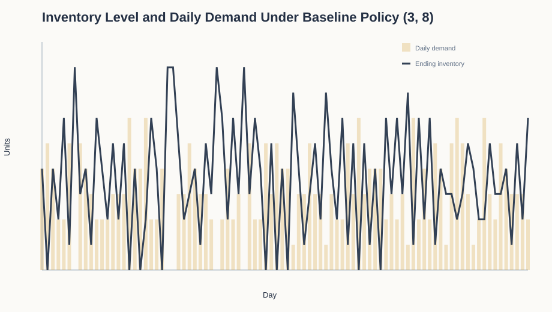
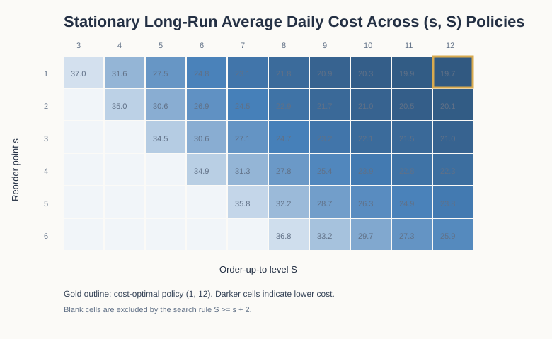
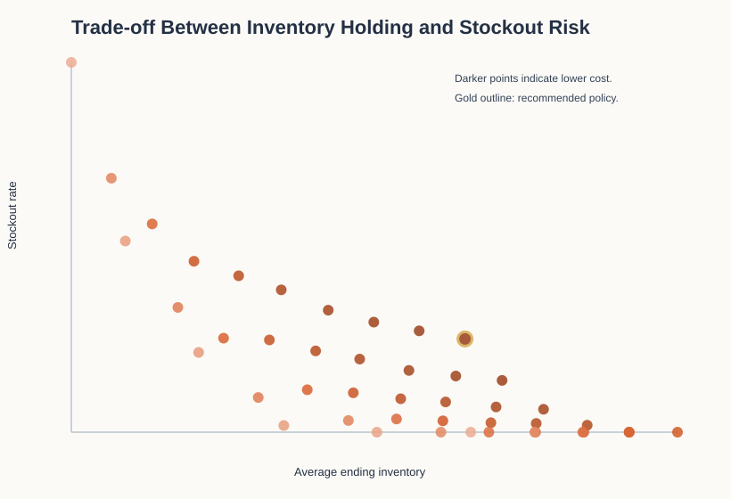
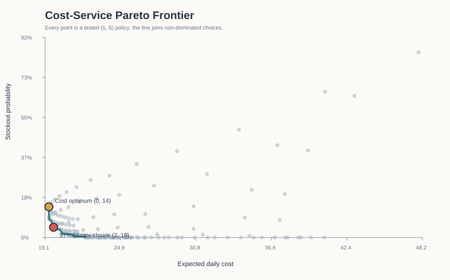
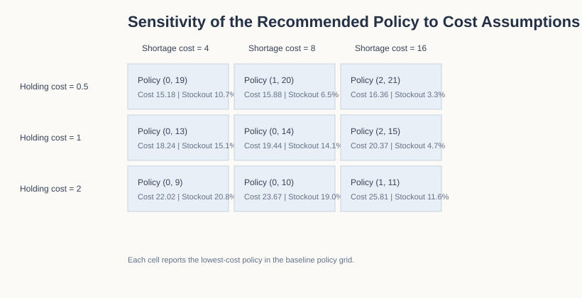

# Stochastic Inventory Optimisation for Ecommerce

## A Markov-Chain and Monte Carlo Study of One USB-C Charging Cable SKU

**Project type:** Applied stochastic-process and operations analytics project  
**Implementation:** Python, NumPy, pandas, SVG visualisation  
**Repository:** See the root [README](../README.md) for reproducibility instructions and generated outputs.

## Abstract

Retailers must decide how much inventory to hold before they know what customers will buy. Too much stock raises holding costs and ties up capital; too little leads to lost sales and unreliable service. This report examines that trade-off for a UK ecommerce fulfilment centre replenishing one standard USB-C charging cable SKU from a nearby central warehouse. The case is illustrative rather than calibrated to a named retailer. The centre uses an `(s, S)` policy: when opening inventory is at or below reorder point `s`, it places an order that raises stock to `S`. Demand is modelled as a discrete random variable, and daily cost includes fixed ordering, unit purchasing, end-of-day holding, and shortage components.

Two methods are used. A finite Markov chain gives the exact long-run performance of each fixed policy from its stationary distribution. Repeated Monte Carlo simulation then checks that calculation. The experiment compares 45 feasible policies, using 200 independent replications that discard 365 warm-up days before measuring 365 days. Under the baseline assumptions, `(1, 12)` has the lowest exact average daily cost: `19.66`. Its simulated mean is also `19.66`, with a 95% interval of `[19.61, 19.71]`; the exact result lies inside that interval. The policy has a `10.69%` stockout rate and a `93.91%` fill rate.

The cost minimum is not automatically the best management choice. When a `97%` fill-rate constraint is imposed, `(2, 12)` becomes the lowest-cost feasible policy. It costs `20.11` per day, only `0.46` more than the unconstrained minimum, while reducing the stockout rate to `5.93%`. Sensitivity analysis further shows that higher shortage penalties support earlier replenishment, while higher holding costs favour leaner stock targets. The value of the work lies in this explicit decision process: assumptions, calculations, and operational trade-offs remain open to inspection.

## 1. Introduction

Inventory management sits at the boundary between quantitative reasoning and everyday business judgment. A retailer must decide how much stock to carry even though demand, supplier performance, customer behaviour, and storage constraints are imperfectly known. The resulting trade-off is familiar: holding too much stock raises storage cost and may leave capital trapped in slow-moving goods; holding too little stock risks stockouts, missed transactions, and an inconsistent customer experience. The correct decision is rarely obvious because these costs interact.

The analysis deliberately keeps the setting narrow: one non-perishable USB-C charging cable SKU, a daily stock review, same-day transfer from a nearby central warehouse, and random demand. Its goal is to find a replenishment rule that balances long-run cost with service performance. There is no black-box prediction system here. Instead, the retailer follows a rule that a manager can explain in one sentence: when inventory reaches a threshold, replenish it to a chosen target. This is an `(s, S)` policy.

Threshold policies have a long history in inventory research, particularly when every order incurs a fixed cost. Arrow, Harris, and Marschak framed early inventory decisions as optimisation under uncertainty [1]. Scarf established the central place of `(s, S)` policies in inventory problems that unfold over time [2], and Iglehart studied their long-run behaviour in infinite-horizon settings [3]. This report does not claim a new theorem. It takes those mathematical ideas and works through a complete application, from code and simulation to figures, validation, and business interpretation.

That full workflow is the point of the project. It draws on the undergraduate mathematics toolkit developed through probability, linear algebra, statistics, stochastic processes, and numerical reasoning, then turns those ideas into tested Python. This combination matters in operations management, business analytics, digital transformation, and information systems, where a model must be rigorous enough to examine and simple enough to discuss with decision makers.

The report addresses five questions:

1. How can an `(s, S)` replenishment policy be expressed as a stochastic state-transition model?
2. Which policy minimises long-run average cost in a baseline grid of alternatives?
3. Does a Monte Carlo implementation agree with the exact Markov-chain calculation?
4. How does the recommendation change when holding cost or shortage cost changes?
5. How does a `97%` fill-rate requirement change the decision?

Any answer must remain conditional. A policy is only as good as the demand distribution, cost structure, and service expectation used to evaluate it. Stating those assumptions plainly allows the result to be challenged and recalculated.

## 2. Background and Project Positioning

An inventory policy specifies when to order and how much to buy. In a periodic-review system, the firm checks stock at regular intervals and acts on its current inventory position. The `(s, S)` policy has two parameters: `s`, the reorder trigger, and `S`, the post-order target. Once stock is low enough, the firm places a single replenishment order instead of adjusting quantity continuously. For a planner, the appeal is practical. A complicated uncertainty problem becomes a rule that is easy to communicate and apply.

The policy becomes especially relevant when each order carries a fixed cost. Administrative work, transport coordination, or minimum processing charges make frequent small orders expensive. Yet ordering a large quantity too early leaves products in storage for longer. The analysis focuses on this tension between ordering less often and carrying more stock.

The literature motivates the policy, but the implementation still depends on modelling choices. A real retailer may face seasonal demand, uncertain lead time, supplier constraints, backorders, and interactions across many products. Here, the scope is limited to one product with independent daily demand so that the state process remains observable and reproducible. Under a fixed policy, tomorrow's inventory depends on today's inventory and a new demand realisation. Earlier events matter only through the current state. That is the Markov property, and it makes an exact long-run calculation possible.

Code can produce a convincing-looking number even when the logic is wrong, so the result is calculated in two independent ways. The Markov method derives the long-run distribution of inventory states. The simulation method draws random demand paths and averages the outcomes across repeated experiments. When the two results agree, confidence in the implementation improves. That agreement is not automatic: a credible simulation still needs a clear experiment design, fixed seeds, enough replications, and outputs that can be inspected [4].

## 3. Problem Definition and Assumptions

Consider a UK ecommerce fulfilment centre holding one standard USB-C charging cable SKU. Time is divided into days, indexed by `t = 1, 2, ...`. At the beginning of each day, the centre observes inventory and, if necessary, requests a transfer from a nearby central warehouse. The transfer is assumed to arrive before that day's demand. Customer demand then occurs, sales cannot exceed available units, and unmet demand is recorded as a lost sale rather than a backorder.

The product category is now concrete, but the setting remains intentionally stylised. It does not represent a named company, and the demand and cost inputs are not estimated from retailer records. The purpose is to make the mathematics and code auditable before an empirical extension. The baseline daily demand distribution is shown below.

| Daily demand `d` | 0 | 1 | 2 | 3 | 4 | 5 | 6 |
| --- | ---: | ---: | ---: | ---: | ---: | ---: | ---: |
| Probability `P(D_t = d)` | 0.05 | 0.10 | 0.20 | 0.25 | 0.20 | 0.12 | 0.08 |

The distribution has an expected demand of `3.12` units per day. It gives substantial probability mass to moderate demand while retaining an upper tail that can create shortages. Demand draws are independent and identically distributed in the baseline model. This assumption is restrictive, but it allows the contribution of the inventory policy to be isolated before adding seasonality or other operational features.

The baseline cost parameters are also set for explanation rather than calibrated from a proprietary dataset.

| Parameter | Interpretation | Value |
| --- | --- | ---: |
| `K` | Fixed cost whenever an order is placed | 30 |
| `c` | Cost per replenished unit | 2 |
| `h` | Holding cost per unit of ending inventory | 1 |
| `p` | Penalty per unit of unsatisfied demand | 8 |

Because each order has a fixed cost, ordering frequency matters. Unfilled demand also carries a penalty, but the value is not high enough to force the model to eliminate every stockout. This creates a genuine trade-off. If zero shortage were required regardless of cost, there would be little left to optimise.

The baseline grid uses reorder points from `1` to `6` and order-up-to levels from `s + 2` to `12`, giving 45 feasible alternatives. This finite grid covers both lean and stock-heavy policies while remaining quick to reproduce. The reported optimum is therefore the best policy in this tested grid, not a proof over every possible value of `s` and `S`.

## 4. Mathematical Formulation

Let `I_t` be opening inventory at the start of day `t`, before any order is placed. Let `D_t` be random demand during that day. For a given policy `(s, S)`, the order quantity is

```text
Q_t = S - I_t,  if I_t <= s
Q_t = 0,        if I_t > s.
```

Available inventory after the replenishment decision is

```text
A_t = I_t + Q_t.
```

Demand is served up to the available stock level. The sales, shortage, and end-of-day inventory equations are

```text
Sales_t = min(A_t, D_t)
Shortage_t = max(D_t - A_t, 0)
I_(t+1) = A_t - Sales_t.
```

The daily cost combines four components:

```text
Cost_t = K * 1{Q_t > 0} + c * Q_t + h * I_(t+1) + p * Shortage_t.
```

The indicator `1{Q_t > 0}` equals one when the retailer orders and zero otherwise. The objective is to minimise long-run expected daily cost. Five metrics describe performance: average daily cost, stockout rate, fill rate, average ending inventory, and average order quantity. Stockout rate measures the share of days with unfilled demand; fill rate measures the share of requested units that are sold. Both are reported because they describe different aspects of service quality.

For a fixed `(s, S)` policy, possible opening states are `0, 1, ..., S`. Let `P_ij` represent the probability of moving from opening inventory state `i` to state `j` in one day. After applying the policy, the available stock is either `S` or `i`, and the next state is `max(A_t - D_t, 0)`. Therefore, each transition probability is obtained by summing the probabilities of demand values that lead to the same next state. The resulting matrix `P` has non-negative elements and every row sums to one.

If `pi` is a stationary distribution, it satisfies

```text
pi = pi P,  with sum_i pi_i = 1.
```

The long-run cost is the expected cost across all states and demand outcomes, weighted by the stationary probability of each state. In the code, `pi` is calculated by power iteration until the maximum change between iterations falls below `1e-14`. Because the state space is finite, the calculation is fast and easy to inspect. The practical meaning is straightforward: recurring state transitions can be used to evaluate a long-run operating policy.

The optimisation itself is exhaustive. The program calculates `C(s,S)` for every policy in the 45-member feasible set, then returns the row with the lowest exact expected cost. A second decision rule first removes policies with fill rate below `97%` and minimises cost over the remaining set. This is a constrained finite optimisation problem:

```text
minimise C(s,S)
subject to FillRate(s,S) >= 0.97.
```

The generated Pareto frontier adds another check. A policy is removed when another policy is no more expensive, has no higher stockout rate, and is strictly better on at least one of those measures. Full derivations are provided in [`docs/mathematical_appendix.md`](../docs/mathematical_appendix.md).

## 5. Implementation and Experimental Design

The implementation is contained in [`src/inventory_model.py`](../src/inventory_model.py). It relies only on Python's standard library, NumPy, and pandas. With so few dependencies, the analysis can be reproduced in VS Code, a terminal, or a GitHub Actions workflow without a complicated setup.

The program is split into small components that can be tested separately. `Policy`, `CostParameters`, and `DemandScenario` are immutable data classes, so the main assumptions remain explicit. `daily_outcome` calculates one period of ordering, sales, ending inventory, shortage, and cost. `simulate_policy` builds a full daily trace for a chosen random seed. `build_transition_matrix` constructs the Markov matrix implied by a policy, `stationary_distribution` calculates the long-run state probabilities, and `markov_policy_metrics` translates those probabilities into business measures. `evaluate_policies` then brings the exact and simulated results together for every policy in the grid.

For every policy, the Monte Carlo experiment runs 200 independent replications. Each replication first runs for 365 warm-up days, which are discarded, and then records the following 365 days. The warm-up matters because starting every replication at full inventory otherwise leaves a small transient bias in a one-year measurement window. Each replication uses a deterministic seed, and policy `j` receives the same demand path as policy `k`. This common-random-numbers design makes comparisons less sensitive to one option receiving an unusually easy or difficult sequence. The script uses replication-level average costs to calculate an approximate 95% confidence interval for the simulated mean.

The project exports all material needed to inspect or reuse the analysis:

| Output | Role in the project |
| --- | --- |
| `baseline_simulation_trace.csv` | A 90-day, row-by-row illustration of the operating logic |
| `policy_evaluation_summary.csv` | Exact and simulated metrics for all 45 policies |
| `service_level_policy_summary.csv` | Unconstrained and 97% fill-rate decision rules |
| `policy_pareto_frontier.csv` | Policies not dominated on cost and stockout rate |
| `cost_sensitivity_summary.csv` | Selected policy under nine alternative cost combinations |
| `model_assumptions.json` | Machine-readable model, cost, and simulation settings |
| `analysis_summary.md` | Generated results narrative used by the GitHub homepage |
| Five SVG figures | Vector-quality plots that render cleanly on GitHub |

The repository includes a regression test suite built with Python's standard library. The tests cover transition-matrix validity, stationary probabilities, fixed-seed reproducibility, a known zero-demand case, invalid policies, warm-up handling, confidence-interval agreement, the `97%` service constraint, and Pareto dominance. On every push or pull request, GitHub Actions installs dependencies, runs the tests, regenerates the analysis, executes the notebook, and rebuilds the PDF. Reproducibility is checked by the workflow rather than left as a promise in the report.

## 6. Baseline Results

Within the tested baseline grid, `(s, S) = (1, 12)` has the lowest exact expected cost: `19.6568` per day. After warm-up, simulation gives `19.6571`, with a 95% interval of `[19.6053, 19.7089]`. The difference between the two estimates is only `0.0003` cost units per day, and the exact value lies inside the simulated interval. The analytical and computational methods now provide a clean validation check.

| Metric | Exact Markov calculation | Monte Carlo estimate |
| --- | ---: | ---: |
| Average daily cost | 19.66 | 19.66 |
| Stockout rate | 10.69% | 10.69% |
| Fill rate | 93.91% | 93.88% |
| Average ending inventory | 4.71 | 4.70 |
| Average daily order quantity | 2.94 | 2.94 |

Several alternatives sit close to the minimum, and that matters more than a winner-takes-all ranking suggests. Policy `(2, 12)` has an exact average cost of `20.11`, only `0.46` above the minimum, while its `5.93%` stockout rate is roughly half that of `(1, 12)`. More importantly, its `97.09%` fill rate makes it the least-cost policy that satisfies the declared `97%` service constraint. A firm focused strictly on modelled cost may choose `(1, 12)`; one with a binding availability promise should choose `(2, 12)` under these assumptions.

| Policy `(s, S)` | Average daily cost | Stockout rate | Fill rate | Average ending inventory |
| --- | ---: | ---: | ---: | ---: |
| `(1, 12)` | 19.66 | 10.69% | 93.91% | 4.71 |
| `(1, 11)` | 19.93 | 11.61% | 93.38% | 4.23 |
| `(2, 12)` | 20.11 | 5.93% | 97.09% | 5.11 |
| `(1, 10)` | 20.34 | 12.61% | 92.83% | 3.74 |
| `(2, 11)` | 20.46 | 6.43% | 96.86% | 4.62 |

The inventory trace shows what the rule looks like in operation. Daily demand gradually draws stock down. Once inventory reaches the trigger, replenishment moves it back to the target. Inventory therefore cycles through a set of states rather than staying constant, and ordering and holding costs arise at different points in that cycle.



The heatmap compares exact average daily cost across all 45 policies. Darker cells indicate lower cost, and the gold outline marks `(1, 12)`. If `S` is too low, shortages and repeated replenishment become expensive. If `s` or `S` is too high, service improves but holding cost accumulates. The minimum lies between those two extremes.



The final baseline figure puts cost and service on the same page. Policies with more average inventory usually have lower stockout rates, but not necessarily lower total cost. Looking only at stockouts would push the decision toward high inventory. Looking only at cost could accept more service risk than the business wants. The plot makes the compromise visible.



The Pareto frontier sharpens that comparison by removing policies that are simultaneously no cheaper and no better on stockouts. The gold point is the cost optimum, while the red point is the lowest-cost policy meeting the `97%` fill-rate requirement.



## 7. Sensitivity Analysis

A recommendation is more informative when readers can see how it changes with the assumptions. The sensitivity analysis varies holding cost over `{0.5, 1, 2}` and shortage cost over `{4, 8, 16}`, with all other baseline settings held constant. For each of the nine scenarios, the program applies the Markov-chain calculation to the same 45-policy grid and selects the lowest-cost option.

| Holding cost | Shortage cost | Best policy | Average daily cost | Stockout rate |
| ---: | ---: | --- | ---: | ---: |
| 0.5 | 4 | `(1, 12)` | 16.54 | 10.69% |
| 0.5 | 8 | `(1, 12)` | 17.30 | 10.69% |
| 0.5 | 16 | `(2, 12)` | 18.29 | 5.93% |
| 1.0 | 4 | `(1, 12)` | 18.89 | 10.69% |
| 1.0 | 8 | `(1, 12)` | 19.66 | 10.69% |
| 1.0 | 16 | `(2, 12)` | 20.84 | 5.93% |
| 2.0 | 4 | `(1, 10)` | 23.19 | 12.61% |
| 2.0 | 8 | `(1, 10)` | 24.08 | 12.61% |
| 2.0 | 16 | `(1, 11)` | 25.81 | 11.61% |

The results move in the expected direction. When shortage cost rises from `8` to `16` and holding cost remains low or moderate, the selected reorder point increases from `1` to `2`. The retailer orders sooner because a missed sale is now more expensive. When holding cost doubles to `2`, the selected order-up-to level falls to `10` or `11`. In those scenarios, leaner stock is worth the additional shortage risk.



The table also limits what can be claimed about `(1, 12)`. It does not mean that every retailer should wait until one unit remains. It means that this policy remains the lowest-cost option across several tested combinations of low-to-moderate holding and shortage costs. If shortage cost includes reputational damage or expensive emergency fulfilment, ordering earlier may be sensible. If the product is costly to store, perishable, or space-intensive, a lower target may fit better.

## 8. Business Interpretation

The first business lesson concerns order frequency. A fixed ordering cost creates an economy of scale, so ordering only when stock is low and replenishing to a relatively high target avoids repeated setup charges. That is why the baseline calculation favours `(1, 12)` over policies with smaller batches. The result should not be reduced to "hold more inventory." The selected policy carries enough stock to order less often while keeping average end-of-day inventory within the tested cost balance.

Cost and service also need separate attention. The lowest-cost policy has a stockout rate above ten percent, which may be difficult to defend for a common charging accessory advertised as available. Policy `(2, 12)` is more than a plausible alternative: it is the exact minimum-cost solution after the `97%` fill-rate constraint is imposed. The extra `0.46` per day, or `2.32%`, buys a `4.75` percentage-point reduction in stockout probability. The numerical minimum becomes an input to management judgement rather than a substitute for it.

Finally, the analysis can be rerun. As the business learns more about demand, lead time, storage costs, or customer behaviour, those inputs can be revised. The code will produce a new recommendation in the same output format. In practice, the process is simple: collect data, update assumptions, run the model, review the cost-service trade-off, and record the decision.

This is a modest but useful form of digital transformation. An informal stocking rule becomes a documented analytical process that a team can inspect and revise. It does not need a large machine-learning system. A well-specified stochastic model is enough to make uncertainty and trade-offs visible.

## 9. Limitations, Ethics, and Next Steps

The model has several important limits. Baseline demand is independent from day to day, whereas real sales often vary with weekdays, promotions, weather, trends, and seasons. Supplier lead time is zero, so no demand arrives while an order is in transit. Shortages become lost sales rather than backorders. The single-product scope also leaves out shared storage, budget constraints, product substitution, and supplier minimum-order requirements.

Those simplifications keep the first version inspectable, but they also point directly to the next one. An openly licensed retail dataset could replace the manually specified demand distribution. Positive lead time could be added by including outstanding orders in the state, and a later multi-product version could introduce shared capacity and budget constraints. The current `97%` service constraint provides a useful template for those larger feasible-set restrictions.

False precision is another concern. The baseline inputs are illustrative, so `19.66` is not a prediction of any real company's daily cost. It is an internally consistent result under the assumptions listed in this report. Before real use, finance and operations teams would need to review the cost parameters, the demand data would need checks for bias and quality problems, and human decision makers would remain responsible for implementation.

## 10. Conclusion

This study applies an `(s, S)` replenishment rule to a UK ecommerce case with stochastic demand. A finite Markov chain provides exact long-run metrics, and warm-up-adjusted Monte Carlo simulation independently checks the implementation. Within the tested baseline grid, `(1, 12)` is the unconstrained cost minimum at `19.66` per day. Once a `97%` fill-rate requirement is imposed, `(2, 12)` becomes the lowest-cost feasible choice at `20.11` per day.

No pair of thresholds is universally correct. The stronger conclusion is that an uncertain stocking decision can be expressed through assumptions, calculations, checks, and trade-offs that other people can inspect. Here, mathematical modelling, Python, and visual analysis support a supply-chain decision without hiding the judgement behind it.

## Reproducibility and AI Assistance Statement

The repository contains the implementation, inputs, generated outputs, executed notebook, test suite, formal PDF, and GitHub Actions workflow. Run `python3 -m unittest discover -s tests -v` to verify model behaviour, then run `python3 src/inventory_model.py` to regenerate the analytical outputs. AI assistance supported structured brainstorming, code review, debugging, prose editing, and visual inspection. Every accepted numerical claim is tied to generated evidence or a regression test. The author remains responsible for the framing, assumptions, mathematics, implementation choices, interpretation, and final presentation; a fuller record appears in [`docs/ai_workflow.md`](../docs/ai_workflow.md).

## References

1. Arrow, K. J., Harris, T., & Marschak, J. (1951). Optimal inventory policy. *Econometrica, 19*(3), 250-272. https://doi.org/10.2307/1906813
2. Scarf, H. (1960). The optimality of `(S, s)` policies in the dynamic inventory problem. In K. J. Arrow, S. Karlin, & P. Suppes (Eds.), *Mathematical Methods in the Social Sciences* (pp. 196-202). Stanford University Press. https://statistics.stanford.edu/technical-reports/optimality-ss-policies-dynamic-inventory-problem
3. Iglehart, D. L. (1963). Optimality of `(s, S)` policies in the infinite horizon dynamic inventory problem. *Management Science, 9*(2), 259-267. https://doi.org/10.1287/mnsc.9.2.259
4. Law, A. M. (2015). *Simulation Modeling and Analysis* (5th ed.). McGraw-Hill Education.
